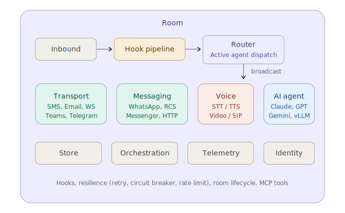
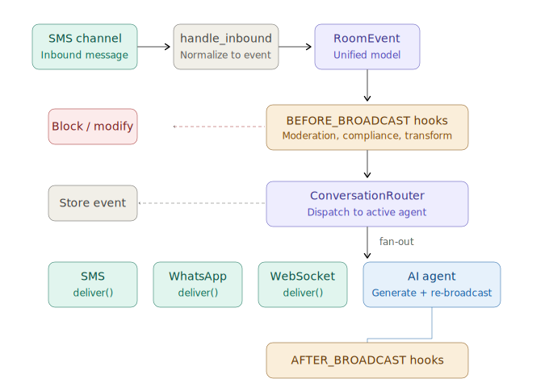
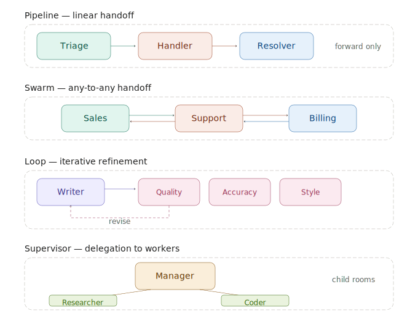
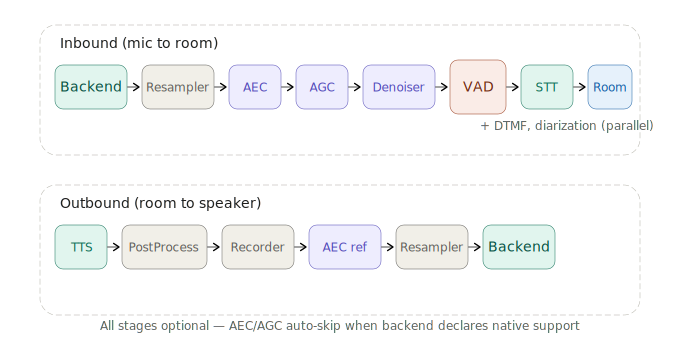
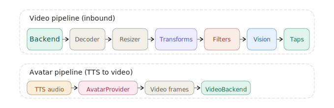

# RoomKit

[](https://pypi.org/project/roomkit/)
[](https://pypi.org/project/roomkit/)
[](LICENSE)

**Pure async Python 3.12+ framework for multi-channel conversation orchestration.**

RoomKit gives you one abstraction — the **room** — to wire together any combination of SMS, WhatsApp, Email, Teams, Telegram, Voice, Video, WebSocket, and AI channels. Messages flow in, pass through a hook pipeline, get routed to the right agent, and broadcast out to every attached channel. You focus on the conversation logic; the framework handles routing, transcoding, audio processing, video processing, and agent handoffs.

**Website:** [roomkit.live](https://www.roomkit.live) &nbsp;|&nbsp; **Docs:** [roomkit.live/docs](https://www.roomkit.live/docs/) &nbsp;|&nbsp; **API Reference:** [roomkit.live/docs/api](https://www.roomkit.live/docs/api/)

---

## How it works



Every channel implements the same interface: `handle_inbound()` converts a provider message into a `RoomEvent`, and `deliver()` pushes events out. Channels have two categories: **transport** (delivers to external systems) and **intelligence** (generates content, like AI agents).

### Message flow



An inbound message is normalized into a `RoomEvent`, passes through the hook pipeline (where it can be blocked, modified, or enriched), gets stored, then fans out to every attached channel. AI agents generate responses that re-enter the same pipeline.

---

## Quickstart

```bash
pip install roomkit
```

### Example: AI chatbot in 20 lines

```python
import asyncio
from roomkit import (
    ChannelCategory, InboundMessage, RoomKit,
    TextContent, WebSocketChannel,
)
from roomkit.channels.ai import AIChannel
from roomkit.providers.anthropic import AnthropicAIProvider, AnthropicConfig

async def main():
    kit = RoomKit()

    # One channel for the user, one for AI
    ws = WebSocketChannel("ws-user")
    ai = AIChannel("assistant", provider=AnthropicAIProvider(
        AnthropicConfig(api_key="sk-...")
    ), system_prompt="You are a helpful assistant.")

    kit.register_channel(ws)
    kit.register_channel(ai)

    # Create a room and wire everything together
    await kit.create_room(room_id="chat")
    await kit.attach_channel("chat", "ws-user")
    await kit.attach_channel("chat", "assistant", category=ChannelCategory.INTELLIGENCE)

    # Process a message — AI responds automatically
    await kit.process_inbound(InboundMessage(
        channel_id="ws-user", sender_id="user-1",
        content=TextContent(body="What is RoomKit?"),
    ))

asyncio.run(main())
```

That's it. The message flows through the hook pipeline, gets routed to the AI channel, and the response is broadcast back to the WebSocket.

### Example: Multi-channel bridge

The same room can bridge any mix of channels — a user on SMS, another on WhatsApp, and an AI assistant all sharing one conversation:

```python
kit = RoomKit()

sms = SMSChannel("sms", provider=TwilioSMSProvider(...))
wa = WhatsAppChannel("whatsapp", provider=...)
ai = AIChannel("assistant", provider=...)

for ch in [sms, wa, ai]:
    kit.register_channel(ch)

await kit.create_room(room_id="support-case-42")
await kit.attach_channel("support-case-42", "sms")
await kit.attach_channel("support-case-42", "whatsapp")
await kit.attach_channel("support-case-42", "assistant", category=ChannelCategory.INTELLIGENCE)

# Message from SMS → broadcast to WhatsApp + AI
# AI reply → broadcast to SMS + WhatsApp
```

Content is automatically transcoded between channel capabilities (rich → text fallback, media handling, etc.).

More examples in [`examples/`](examples/).

---

## Installation

RoomKit's core has a single dependency (`pydantic`). Everything else is optional:

```bash
pip install roomkit                    # core only
pip install roomkit[anthropic]         # + Anthropic Claude
pip install roomkit[openai]            # + OpenAI GPT
pip install roomkit[gemini]            # + Google Gemini

# Voice & video
pip install roomkit[fastrtc]           # WebRTC audio
pip install roomkit[sip]               # SIP voice + video
pip install roomkit[deepgram]          # Deepgram STT
pip install roomkit[elevenlabs]        # ElevenLabs TTS
pip install roomkit[sherpa-onnx]       # Local STT/TTS/VAD/Denoiser (ONNX)
pip install roomkit[realtime-gemini]   # Gemini Live (speech-to-speech)
pip install roomkit[realtime-openai]   # OpenAI Realtime (speech-to-speech)

# Messaging
pip install roomkit[httpx]             # SMS, RCS, Email providers
pip install roomkit[teams]             # Microsoft Teams
pip install roomkit[telegram]          # Telegram
pip install roomkit[neonize]           # WhatsApp Personal

# Infrastructure
pip install roomkit[postgres]          # PostgreSQL storage
pip install roomkit[opentelemetry]     # Distributed tracing
pip install roomkit[mcp]               # Model Context Protocol tools

# Everything
pip install roomkit[all]
```

For development:

```bash
git clone https://github.com/roomkit-live/roomkit.git
cd roomkit
uv sync --extra dev
make all                               # ruff check + mypy --strict + pytest
```

Requires **Python 3.12+**.

---

## Multi-Agent Orchestration



RoomKit has four built-in orchestration strategies, all configured through `RoomKit(orchestration=...)`. The framework handles agent registration, routing, handoff tools, and conversation state — you just define agents and pick a strategy.

### Agents

`Agent` extends `AIChannel` with identity metadata (role, scope, voice, greeting) that gets auto-injected into the system prompt:

```python
from roomkit import Agent
from roomkit.providers.anthropic import AnthropicAIProvider, AnthropicConfig
from roomkit.orchestration.handoff import HandoffMemoryProvider
from roomkit.memory.sliding_window import SlidingWindowMemory

triage = Agent(
    "agent-triage",
    provider=AnthropicAIProvider(AnthropicConfig(api_key="sk-...")),
    role="Triage receptionist",
    description="Routes callers to the right specialist",
    system_prompt="You triage incoming requests.",
    voice="Zephyr",              # TTS voice ID
    language="French",
    greeting="Greet the caller warmly and ask how you can help.",
    memory=HandoffMemoryProvider(SlidingWindowMemory(max_events=20)),
)
```

### Pipeline — linear handoff chain

Agents hand off to the next in a fixed sequence. Each agent gets a `handoff_conversation` tool and can only move forward:

```python
from roomkit import Agent, Pipeline, RoomKit

kit = RoomKit(
    orchestration=Pipeline(agents=[triage, handler, resolver]),
)
```

### Swarm — any-to-any handoff

Every agent can hand off to any other. The AI decides when a topic change requires a different specialist:

```python
from roomkit import Agent, Swarm, RoomKit

kit = RoomKit(
    orchestration=Swarm(
        agents=[sales, support, billing],
        entry="agent-sales",
    ),
)
```

### Loop — iterative refinement

A producer agent generates content, one or more reviewers evaluate it (sequentially or in parallel), and the cycle repeats until all approve or max iterations are reached:

```python
from roomkit import Agent, Loop, RoomKit

kit = RoomKit(
    orchestration=Loop(
        agent=writer,
        reviewers=[quality, accuracy, style],
        strategy="parallel",
        max_iterations=3,
    ),
)
```

### Supervisor — delegating to workers

A supervisor agent talks to the user and delegates tasks to workers that run in isolated child rooms:

```python
from roomkit import Agent, Supervisor, RoomKit

kit = RoomKit(
    orchestration=Supervisor(
        supervisor=manager,
        workers=[researcher, coder],
    ),
)
```

### Voice orchestration

All orchestration strategies work seamlessly on live voice calls. The voice/realtime channel is a transport — swapping the active agent doesn't touch the audio session:

```
SIP Call → VoiceChannel (STT) → transcript → Router → Active Agent
                                                          │
                                                     text response
                                                          │
                                         VoiceChannel (TTS) ← ─┘
```

For speech-to-speech mode (Gemini Live, OpenAI Realtime), the realtime session is reconfigured on handoff — system prompt, voice, and tools change with ~200-500ms latency while the audio stream stays connected.

---

## Audio Pipeline



All stages are optional. AEC and AGC are automatically skipped when the backend declares native support.

| Stage | Role | Implementations |
|-------|------|-----------------|
| VAD | Voice activity detection | SherpaOnnx, Energy-based |
| Denoiser | Noise reduction | RNNoise, SherpaOnnx |
| AEC | Acoustic echo cancellation | Speex |
| STT | Speech-to-text | Deepgram, SherpaOnnx, Qwen, Gradium |
| TTS | Text-to-speech | ElevenLabs, SherpaOnnx, Qwen, Gradium, Grok |
| Diarization | Speaker identification | Pluggable |
| DTMF | Tone detection (parallel) | Pluggable |

**Interruption strategies** control how user speech during TTS playback is handled: `IMMEDIATE`, `CONFIRMED` (wait for sustained speech), `SEMANTIC` (backchannel detection ignores "uh-huh"), or `DISABLED`.

```python
voice = VoiceChannel(
    "voice", stt=stt, tts=tts, backend=backend,
    pipeline=AudioPipelineConfig(vad=vad, denoiser=denoiser, aec=aec),
    interruption=InterruptionConfig(
        strategy=InterruptionStrategy.CONFIRMED, min_speech_ms=300
    ),
)
```

---

## Hooks

Hooks intercept events at specific points in the pipeline. They can block, modify, or observe events:

```python
@kit.hook(HookTrigger.BEFORE_BROADCAST, name="compliance_check")
async def check(event: RoomEvent, ctx: RoomContext) -> HookResult:
    if contains_pii(event.content):
        return HookResult.block("PII detected")
    return HookResult.allow()
```

**35 hook triggers** across the full lifecycle: event pipeline (`BEFORE_BROADCAST`, `AFTER_BROADCAST`), room lifecycle, channel lifecycle, identity resolution, voice events (speech start/end, transcription, barge-in, VAD, DTMF, speaker change), TTS events, tool execution, orchestration (phase transitions, handoffs), and side effects (delivery status, errors, protocol traces).

Hooks support filtering by channel type, channel ID, and direction.

---

## Channels & Providers

| Channel | Media | Provider examples |
|---------|-------|-------------------|
| SMS / RCS | text, MMS, rich cards | Twilio, Telnyx, Sinch |
| Email | text, rich, media | ElasticEmail, SendGrid |
| WhatsApp | text, media, location, templates | Cloud API, Neonize (Personal) |
| Messenger | text, rich, templates | Facebook Messenger |
| Teams | text, rich | Bot Framework |
| Telegram | text, rich, media | Telegram Bot API |
| WebSocket | text, rich, media | Built-in |
| HTTP | text, rich | Generic webhook |
| Voice | audio ↔ text | STT/TTS pipeline |
| Realtime Voice | audio (S2S) | Gemini Live, OpenAI Realtime |
| Video | video | SIP/RTP, Webcam, Screen capture |
| Audio+Video | audio + video | SIP A/V (VP9/H.264) |
| AI / Agent | text, rich | Claude, GPT, Gemini, Mistral, vLLM |

Every AI and transport provider has a **mock counterpart** for testing without credentials.

---

## Video Pipeline



Like the audio pipeline, the video subsystem processes frames through pluggable stages:

```
Inbound:   Backend → [Decoder] → [Resizer] → [Transforms...] → [Filters...] → Vision / Taps
```

All stages are optional — configure only what you need.

| Stage | Role | Implementations |
|-------|------|-----------------|
| Decoder | Encoded → raw pixels | PyAV (H.264, VP9, VP8) |
| Resizer | Scale to target dimensions | PyAV |
| Transforms | Modify pixel data | Grayscale, blur, effects (OpenCV) |
| Filters | Inspect or replace frames | YOLO object detection, Censor, Watermark |
| Vision | Periodic frame analysis → AI context | OpenAI, Gemini |

```python
from roomkit import VideoChannel
from roomkit.video.pipeline import VideoPipelineConfig
from roomkit.video.pipeline.filter.yolo import YOLODetectorFilter
from roomkit.video.pipeline.filter.watermark import WatermarkFilter

video = VideoChannel(
    "video",
    backend=backend,
    pipeline=VideoPipelineConfig(
        filters=[
            YOLODetectorFilter(model="yolo11n.pt", confidence=0.5),
            WatermarkFilter(text="CONFIDENTIAL", position="bottom-right"),
        ],
        vision=gemini_vision,
    ),
)
```

### Video backends

| Backend | Role | Dependency |
|---------|------|------------|
| `SIPVideoBackend` | SIP A/V calls (VP9/H.264/VP8) | `roomkit[sip]` |
| `RTPVideoBackend` | Raw RTP video transport | `roomkit[rtp]` |
| `LocalVideoBackend` | Webcam capture (OpenCV) | `roomkit[local-video]` |
| `ScreenCaptureBackend` | Screen capture (mss) | `roomkit[screen-capture]` |

### Talking avatars

Avatar providers generate lip-synced video from TTS audio — the visual counterpart of text-to-speech:

```
AI text → TTS → audio ──┬── VoiceBackend (send audio)
                         └── AvatarProvider (audio → video frames)
                                  │
                             VideoBackend (send video)
```

Implementations: MuseTalk (local inference), WebSocket (remote), Anam (cloud).

### Recording

Room-level A/V recording to MP4 with VP9 → H.264 transcoding, per-track sync, and NVENC hardware acceleration:

```python
from roomkit import AudioVideoChannel
from roomkit.video.pipeline import VideoPipelineConfig
from roomkit.video.recorder.pyav import PyAVVideoRecorder
from roomkit.video.recorder import VideoRecordingConfig

video = VideoChannel(
    "video",
    backend=backend,
    pipeline=VideoPipelineConfig(
        recorder=PyAVVideoRecorder(),
        recording_config=VideoRecordingConfig(
            storage="./recordings", codec="auto", fps=15.0,
        ),
    ),
)
```

---

## Production Features

### Storage

```python
kit = RoomKit()                          # InMemoryStore (development)
kit = RoomKit(store=PostgresStore(...))   # PostgreSQL (production)
```

The store persists rooms, events, bindings, participants, identities, tasks, and observations.

### Resilience

Built-in retry with exponential backoff, circuit breaker isolation, token bucket rate limiting, content transcoding, chain depth tracking (prevents infinite loops), and idempotency keys.

```python
await kit.attach_channel("room-1", "sms-out",
    retry_policy=RetryPolicy(max_retries=3, base_delay_seconds=1.0),
    rate_limit=RateLimit(max_per_second=5.0),
)
```

### Room lifecycle

Rooms transition automatically based on activity timers:

```
ACTIVE ──(inactive timeout)──► PAUSED ──(closed timeout)──► CLOSED
```

### Telemetry

```python
kit = RoomKit(telemetry=TelemetryConfig(provider=ConsoleTelemetryProvider()))     # dev
kit = RoomKit(telemetry=TelemetryConfig(provider=OpenTelemetryProvider()))         # production
```

### Identity resolution

Resolve unknown senders to known identities with a pluggable pipeline:

```python
class MyResolver(IdentityResolver):
    async def resolve(self, message, context):
        user = await lookup(message.sender_id)
        if user:
            return IdentityResult(
                status=IdentificationStatus.IDENTIFIED,
                identity=Identity(id=user.id, display_name=user.name),
            )
        return IdentityResult(status=IdentificationStatus.UNKNOWN)

kit = RoomKit(identity_resolver=MyResolver())
```

### MCP Tools

```python
from roomkit import MCPToolProvider, compose_tool_handlers

mcp = MCPToolProvider(server_url="http://localhost:3000")
handler = compose_tool_handlers(mcp.handler, my_custom_handler)
```

### Skills

Extensible AI capabilities via a skill registry:

```python
registry = SkillRegistry()
registry.register(Skill(
    metadata=SkillMetadata(name="weather", description="Get weather forecasts"),
    handler=my_weather_handler,
))
```

### Realtime events

Handle typing indicators, presence, read receipts, and tool call notifications:

```python
sub_id = await kit.subscribe_room("room-1", handle_realtime)
await kit.publish_typing("room-1", "user-1")
await kit.publish_presence("room-1", "user-1", "online")
```

---

## Project Structure

```
src/roomkit/
  core/            Framework, hooks, routing, retry, circuit breaker
  channels/        Channel implementations (Voice, AI, Agent, WebSocket, ...)
  orchestration/   Multi-agent routing, handoff, pipeline, conversation state
  providers/       Provider implementations (AI, SMS, Email, Teams, ...)
  voice/           Voice subsystem
    backends/        Audio transports (FastRTC, RTP, SIP, Local)
    stt/             Speech-to-text providers
    tts/             Text-to-speech providers
    pipeline/        Audio processing stages (VAD, AEC, AGC, Denoiser, ...)
    realtime/        Speech-to-speech (Gemini Live, OpenAI Realtime)
  video/           Video subsystem (RTP, SIP, Local, Screen, Vision AI)
  recorder/        Room-level A/V recording (PyAV)
  models/          Pydantic data models and enums
  memory/          AI context construction (SlidingWindow, Handoff-aware)
  orchestration/   Pipeline, Loop, Supervisor, Swarm
  store/           Conversation persistence (Memory, Postgres)
  identity/        User identification resolution
  telemetry/       Tracing (Console, OpenTelemetry)
```

## AI Assistant Support

RoomKit includes files to help AI coding assistants understand the library:

- **[llms.txt](https://www.roomkit.live/llms.txt)** — structured documentation for LLM context windows
- **[AGENTS.md](AGENTS.md)** — coding guidelines and patterns for AI assistants
- **[MCP Integration](https://www.roomkit.live/docs/mcp/)** — Model Context Protocol support

## Contributing

See [CONTRIBUTING.md](CONTRIBUTING.md) and [CODE_OF_CONDUCT.md](CODE_OF_CONDUCT.md).

```bash
uv sync --extra dev
make all                # ruff check + mypy --strict + pytest
```

All new code needs tests. Aim for >90% coverage.

## License

[MIT](LICENSE)
